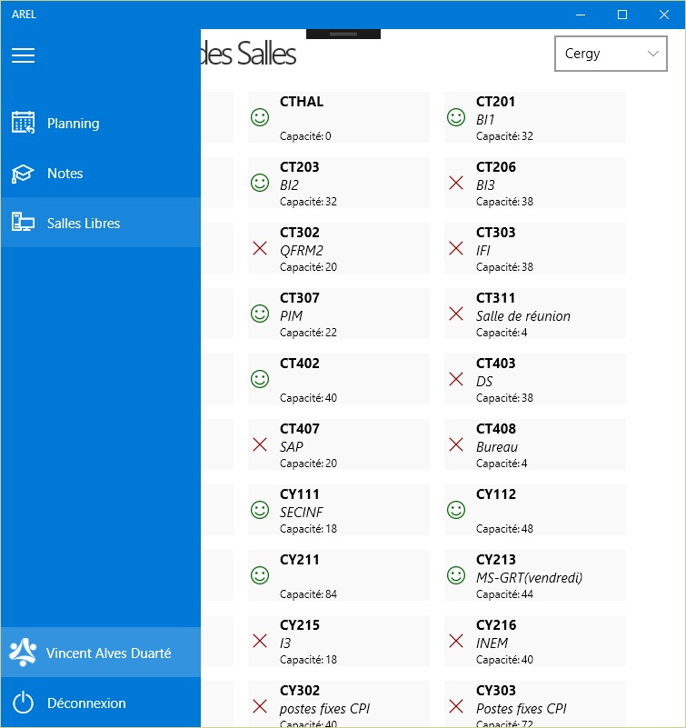

Windows 10 AREL
===============
Une application cross-devices Windows 10 utilisant l'api d'AREL pour :
- Voir son emploi du temps à la journée et synchroniser automatiquement le calendrier Windows 10 avec le planning AREL  
- Connaître les salles libres sur les deux campus (et plus si affinités, la liste est dynamique 👌 )  
- Récuperer les notes si un jour l'API arrête d'être merdique et permet aux élèves de récupérer leurs propres notes  
- Afficher ses absences si un jour l'API le permet aussi... On est pas des sorciers.  

  
