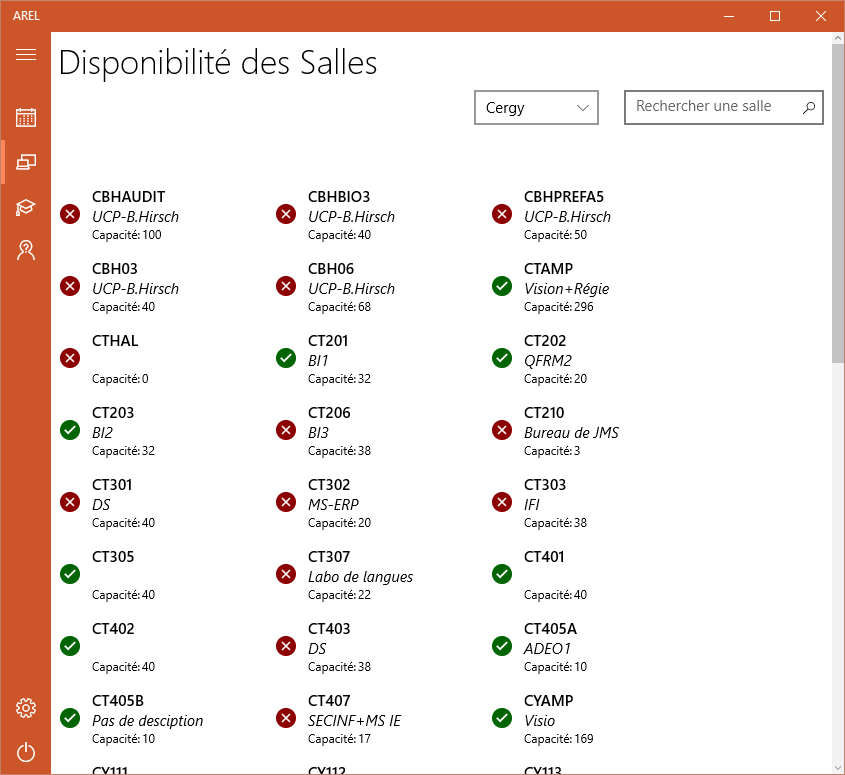

Windows 10 AREL
===============
Une application cross-devices Windows 10 utilisant l'api d'AREL pour :
- Voir son emploi du temps à la journée et synchroniser automatiquement le calendrier Windows 10 avec le planning AREL  
- Connaître les salles libres sur les deux campus (et plus si affinités, la liste est dynamique 👌 )  
- Afficher ses notes (mais sans calcul de moyenne à cause d'un manque d'informations)
- Afficher ses absences si un jour l'API le permet... On est pas des sorciers.  

*Déployer cette appli  
Un fichier Resources.resw doit être ajouté dans le projet arelv1, contenant votre clé d'API(APIKey) et un login/mot de passe de test (LoginTest/PasswordTest).  

  

