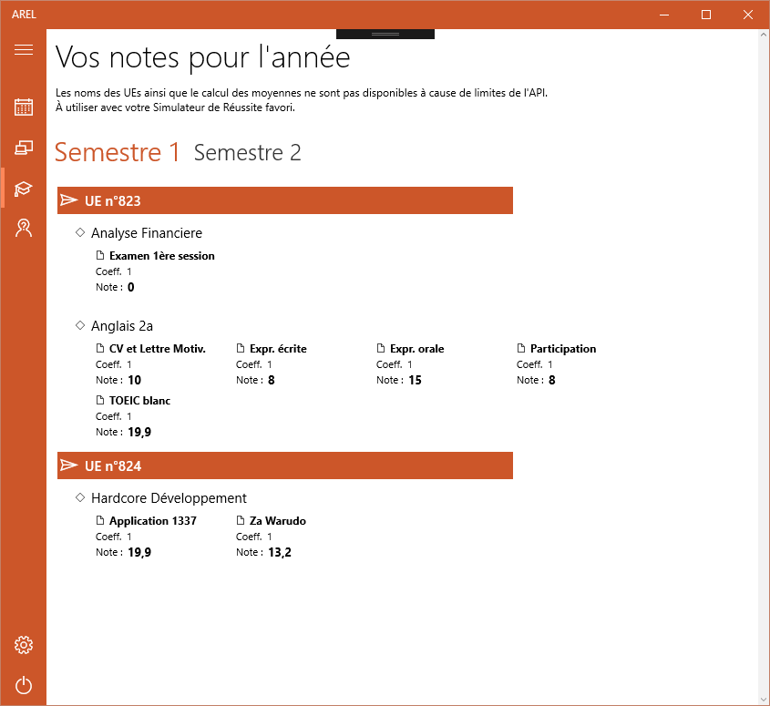

Windows 10 AREL
===============
Une application cross-devices Windows 10 utilisant l'api d'AREL pour :
- Voir son emploi du temps sur deux jours et synchroniser automatiquement le calendrier Windows 10 avec le planning AREL  
- Connaître les salles libres sur les deux campus (et plus si affinités, la liste est dynamique 👌 )  
- Afficher ses notes 
- Afficher ses absences  
  
===============
* Déployer cette appli  
Un fichier Resources.resw doit être ajouté dans le projet arelv1, contenant votre clé d'API AREL sous le nom "APIKey".  
Un mode de test sans usage de l'API peut être activé en se loggant avec les identifiants windows10test/Developers .  

 
  

  

